
<strong>Officine Bitcoin</strong> Lezioni online Bitcoin-only This project is maintained by valerio-vaccaro

# Officine Bitcoin

## 🌍 Lingue

[🇨🇳 中文](./index.zh.html) [🇬🇧 English](./index.en.html) [🇪🇸 Español](./index.es.html) [🇵🇹 Português](./index.pt.html) [🇷🇺 Русский](./index.ru.html) [🇫🇷 Français](./index.fr.html) [🇩🇪 Deutsch](./index.de.html) [🇮🇹 Italiano](./index.html) [🇭🇺 Magyar](./index.hu.html) [🏳️ Milanés](./index.mi.html) [🏳️ Veneto](./index.ve.html)

## ₿ Cos'è Officine Bitcoin

Officine Bitcoin è una serie di lezioni online gratuite e ricorrenti dedicate a Bitcoin e a temi tecnici affini.

Ogni incontro dura al massimo 30 minuti: una prima parte è dedicata alla lezione, mentre il tempo restante è riservato a domande, confronto e supporto ai partecipanti.

Le lezioni si tengono su Telegram nel gruppo di [Officine Bitcoin](https://t.me/officinebitcoin).

{: .splash-image }

## 🔐 Sicurezza e privacy

Non condividere mai informazioni personali, seed phrase, mnemonic phrase, chiavi private o altri segreti con la classe, con l'istruttore o in chat privata.

Le lezioni e il dibattito non vengono registrati. Se perdi un incontro, puoi partecipare al successivo per imparare o porre i tuoi dubbi.

## 👨‍🏫 Chi tiene le lezioni

Le lezioni possono essere tenute da chiunque abbia competenza su un tema e voglia condividerla con la community. Se hai un argomento utile, puoi proporre o creare una nuova lezione.

## 🤝 Come contribuire

- Puoi tenere una serie di lezioni su un tema che conosci bene, aiutando altre persone a comprenderlo.
- Puoi suggerire nuovi argomenti e aiutare a trovare istruttori adatti.
- Puoi far conoscere il progetto Officine Bitcoin a chi vuole studiare Bitcoin in modo serio e gratuito.

## 🚫 Offtopic

Tutto ciò che non è inerente alla lezione, anche se interessante, è offtopic e può essere affrontato solo creando un evento dedicato.

Rimane proibito creare lezioni su:

- shitcoin, altcoin, token e simili;
- politica, partiti ed elezioni, fatta eccezione per la politica monetaria;
- sport, squadre e competizioni sportive;
- sesso.

## 💸 Raccolte fondi, pagamenti e oboli

Officine Bitcoin è gratuito e aperto a tutti. Raccolte fondi, contributi obbligatori e pagamenti per seguire le lezioni sono proibiti.

## 📄 Licenze e attribuzioni

Il materiale prodotto durante le lezioni di Officine Bitcoin viene pubblicato con licenza Creative Commons [CC BY-SA 4.0](https://creativecommons.org/licenses/by-sa/4.0/legalcode.it).

Il [logo ufficiale di Officine Bitcoin](./logo/index.html) è coperto dalla stessa licenza.

## Lezioni

|  | Argomento |
|---|---|
| <a href="./lezioni/mnedad/index.html">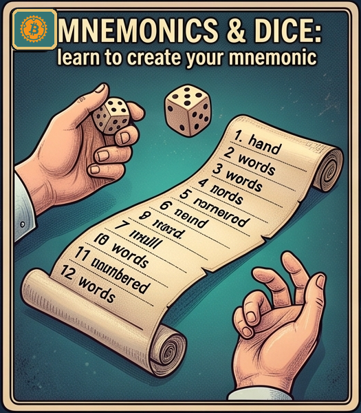</a> | [Mnemoniche & dadi: impara a creare la tua mnemonica](./lezioni/mnedad/index.html) |
| <a href="./lezioni/fulhar/index.html">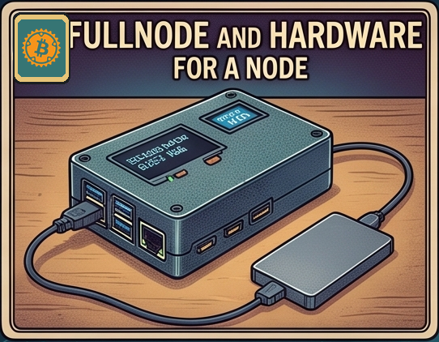</a> | [Fullnode ed hardware per un nodo](./lezioni/fulhar/index.html) |
| <a href="./lezioni/hansol/index.html">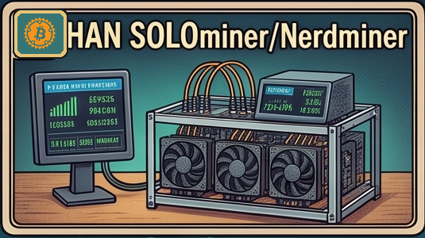</a> | [HAN SOLOminer/Nerdminer](./lezioni/hansol/index.html) |
| <a href="./lezioni/tercar/index.html">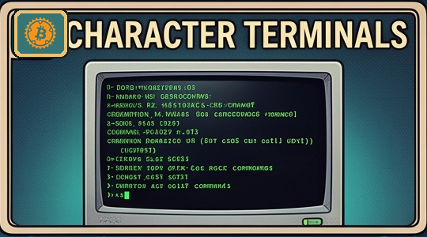</a> | [Terminali a caratteri](./lezioni/tercar/index.html) |
| <a href="./lezioni/openso/index.html">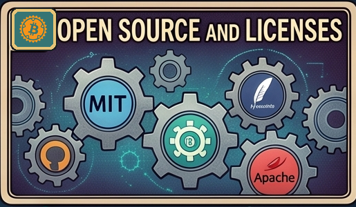</a> | [Open source e licenze](./lezioni/openso/index.html) |
| <a href="./lezioni/debian/index.html">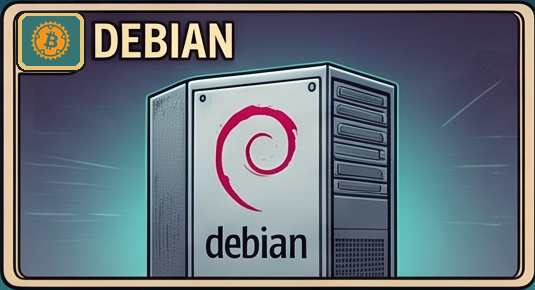</a> | [Debian](./lezioni/debian/index.html) |
| <a href="./lezioni/firme/index.html">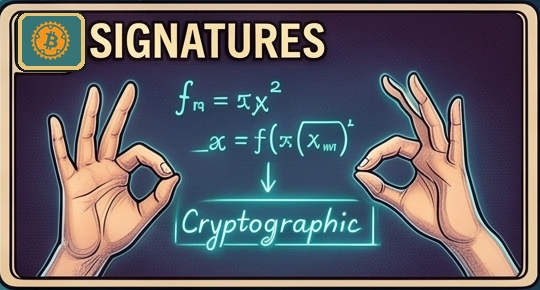</a> | [Firme](./lezioni/firme/index.html) |
| <a href="./lezioni/jadeset/index.html">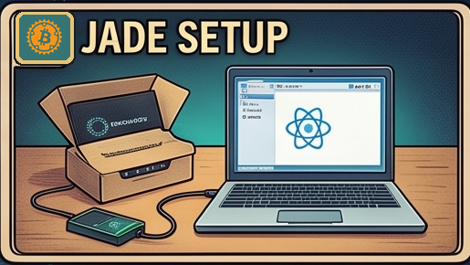</a> | [Jade Setup](./lezioni/jadeset/index.html) |
| <a href="./lezioni/jadeele/index.html">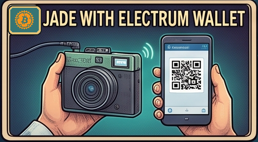</a> | [Jade con Electrum Wallet](./lezioni/jadeele/index.html) |
| <a href="./lezioni/jadespa/index.html">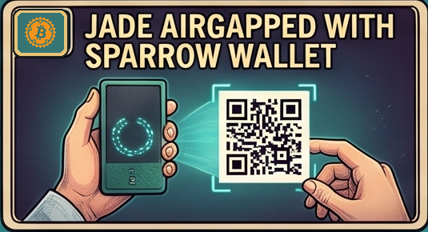</a> | [Jade airgapped con Sparrow Wallet](./lezioni/jadespa/index.html) |
| 🔐 | [Jade come chiave SSH](./lezioni/jadssh/index.html) |
| 🔏 | [Jade con GPG](./lezioni/jadgpg/index.html) |
| 🔢 | [Jade come autenticatore OTP](./lezioni/jadotp/index.html) |
| <a href="./lezioni/ciclo/index.html">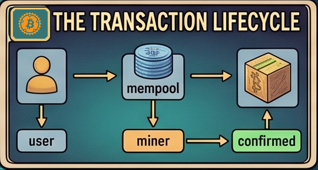</a> | [Il ciclo di vita di una transazione](./lezioni/ciclo/index.html) |
| <a href="./lezioni/mining/index.html">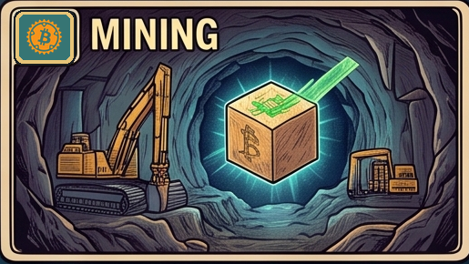</a> | [Mining](./lezioni/mining/index.html) |
| <a href="./lezioni/descr/index.html">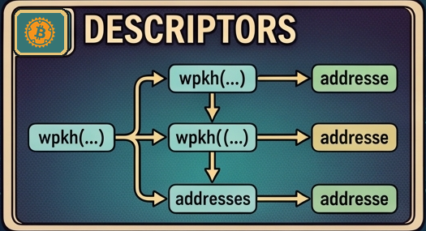</a> | [Descriptor](./lezioni/descr/index.html) |
| <a href="./lezioni/mesh/index.html">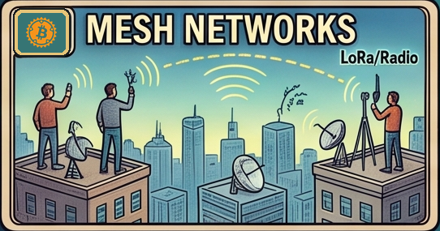</a> | [Reti Mesh](./lezioni/mesh/index.html) |
| <a href="./lezioni/coinco/index.html">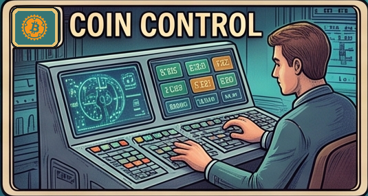</a> | [Coin Control](./lezioni/coinco/index.html) |
| <a href="./lezioni/gpg/index.html">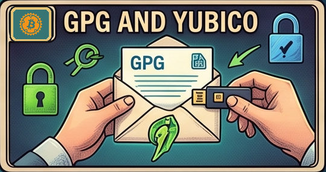</a> | [GPG e Yubico](./lezioni/gpg/index.html) |
| <a href="./lezioni/mempush/index.html">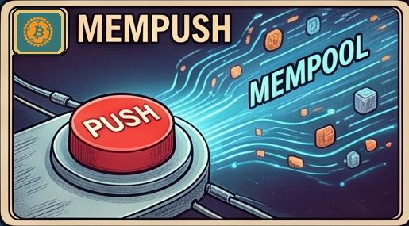</a> | [MemPush](./lezioni/mempush/index.html) |
| <a href="./lezioni/ghostin/index.html">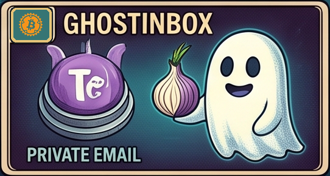</a> | [Ghostinbox](./lezioni/ghostin/index.html) |
| <a href="./lezioni/start/index.html">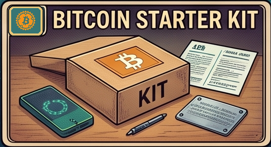</a> | [LN Starter Kit](./lezioni/start/index.html) |
| <a href="./lezioni/verifica/index.html">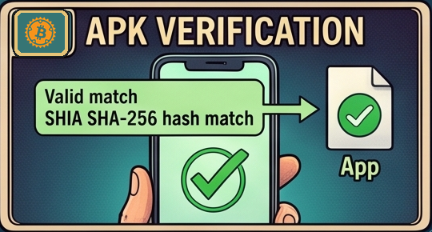</a> | [Verifica APK](./lezioni/verifica/index.html) |
| <a href="./lezioni/canale/index.html">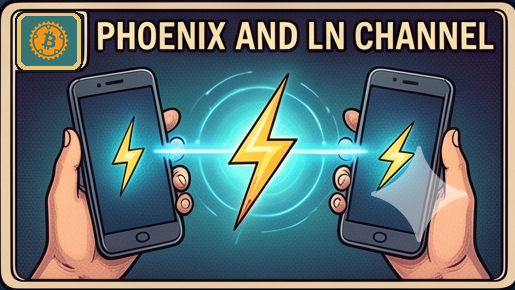</a> | [Phoenix e canale LN](./lezioni/canale/index.html) |
